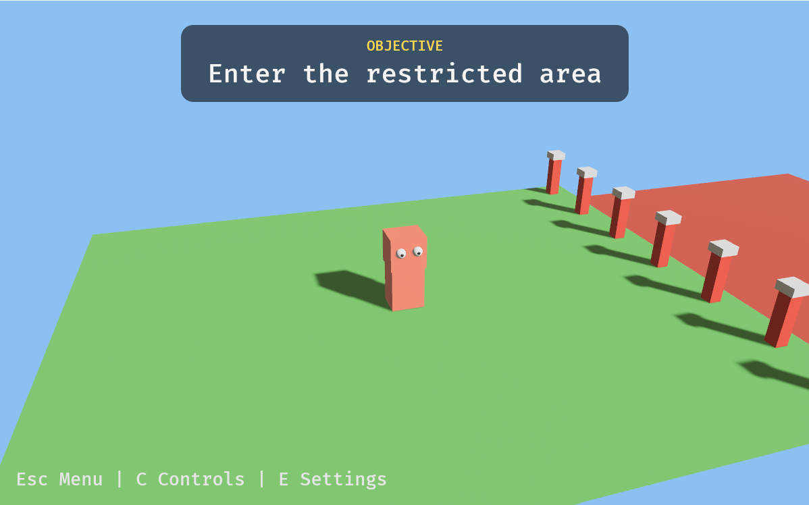

# bevy-cuboid-game

A small 3D game written in Rust with [Bevy](https://bevyengine.org), built as a
practice range for **game debugging**. The package, the executable and the
window title are all `bevy-cuboid-game`, so it is easy to find in a process
list.



## The idea

Every level is designed so that it **cannot be beaten by playing normally**.
The health pickups never quite reach the target, the AI racers are strictly
faster than you, the bomb always goes off. The intended solve is to attach a
debugger or a memory editor to the running process and change the game's state
from the outside — search for a value, freeze it, set a watchpoint, breakpoint
the function that checks the win condition, patch out the instruction that
counts down.

The build is set up to make that pleasant rather than adversarial:

- release builds keep full debug info (`debug = true`, `strip = false` in
  `Cargo.toml`) — symbols are there on purpose;
- the functions you are meant to breakpoint are marked `#[inline(never)]`
  (`src/player.rs`, `src/level101/debugger.rs`) so they survive optimization;
- several levels place in-world signs naming the actual field to look for.

The challenge design follows two references kept in the repo:
`src/docs/CE-tutorial.md` (the Cheat Engine tutorial steps) and
`src/docs/DC-GHVillage.md` (notes from the DEFCON Game Hacking Village).

## Levels

| # | Level | Objective |
|---|-------|-----------|
| 1 | The Password Gate | Enter the restricted area |
| 2 | The Cannon Gauntlet | Reach 100 health |
| 3 | The Countdown | Survive 5 seconds after the bomb would explode |
| 4 | The Invisible Maze | Reach the trophy |
| 5 | The Rigged Race | Win the race |

No solutions here — that is the whole exercise. Each level has an in-game hint
(`H`) and a full walkthrough (`T`) if you want them.

Two larger sandbox levels — *The Hill Fortress* and *The Indoor Waterpark* —
are hidden. Press `?` on the menu to reveal them; they only join the
`Solved: n / m` count once revealed.

## Controls

**Keyboard / mouse**

| Key | Action |
|-----|--------|
| `W` `A` `S` `D` / arrows | Move (camera-relative) |
| `Space` | Jump |
| Mouse | Look |
| Wheel | Zoom |
| `Esc` | Close dialog / back to menu |
| `P` | Pause |
| `C` | Controls |
| `E` | Settings (mouse sensitivity) |
| `H` | Hint |
| `T` | Walkthrough |
| `X` | Close hint / walkthrough |
| `F3` | Diagnostics overlay |
| `1`–`9` (menu) | Launch the Nth level |
| `?` (menu) | Reveal hidden levels |

**Gamepad**

| Input | Action |
|-------|--------|
| Left stick / D-pad | Move |
| `A` | Jump |
| Right stick | Look |
| `LT` / `RT` | Zoom |
| `Select` | Close dialog / back to menu |
| `Start` | Pause |

On-screen prompts switch between keyboard and gamepad wording automatically
based on which one you last touched.

## Download

Prebuilt Windows binaries for x64 and arm64 are on the
[Releases](https://github.com/org62/bevy-cuboid-game/releases) page. Each zip
contains `bevy-cuboid-game.exe` and its matching `bevy_cuboid_game.pdb`; unzip
both into the same folder so your debugger picks up symbols automatically. (The
underscores in the `.pdb` name are rustc's, not a typo — it has to keep that
name for the exe to find it.) The `.exe` runs standalone — there are no
external assets to install.

## Build from source

Rust 2021, Bevy 0.15. No system dependencies beyond a working GPU driver.

```sh
cargo run --release     # what you want for playing and for debugging
cargo run               # dev build; the dev profile is already tuned for playable frame times
cargo test              # 84 unit tests (collision core, frame pacing, level logic)
```

There is also a self-playing harness that runs the whole game unattended at 4x
speed and exits when done — useful as a smoke test after changes:

```sh
cargo run --release --features test_bot
```

## Debugging aids built into the game

- **`F3` overlay** (`src/shared_ui/diag.rs`) — fps, estimated display refresh
  interval, sim-vs-wall-clock drift, raw versus simulated frame times, and the
  detected mouse mode. First stop for any "it feels choppy" or "the mouse is
  spinning" report.
- **Frame pacing** (`src/frame_pacing.rs`) — the sim advances by exactly one
  refresh interval per presented frame, with a bounded debt term, instead of
  integrating the CPU frame loop's very jittery raw delta.
- **Raw mouse normalization** (`src/raw_mouse.rs`) — absolute pointers (RDP,
  VMs, streaming clients) report *positions* where winit claims deltas; this
  differentiates them back into motion.

`CLAUDE.md` holds the full engineering notes: the level architecture, system
ordering, collision rules, and the reasoning behind each of the above.

## Platform

Developed and tested on Windows, and the challenges assume a Windows-style
memory editor attached to the process. The code itself is portable — no
`windows`/`winapi` dependency, and the only `cfg(target_os = "windows")` is the
optional icon embed in `build.rs`, which does not fail the build elsewhere.
